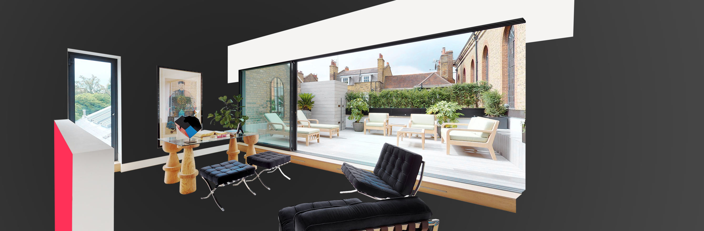

# Introduction

<figure><figcaption></figcaption></figure>

### Introduction

The Matterport 3D Showcase SDK is a javascript library for third-party developers to integrate Matterport with their web applications. Developers can deeply customize the 3D Showcase experience and build entire applications off of Matterport, enabling many exciting new use cases.

### SDK for Embeds

With this SDK, developers can

* Execute actions to control 3D Showcase from their web app. For example, the user clicks a button on a webpage and moves to a specific location in the Matterport Space.
* Listen to events from 3D Showcase and respond in their web app. For example, play a sound or voiceover when the user goes to a certain location in the Matterport Space.

[SDK for Embeds](broken-reference)

### SDK Bundle

This sdk is an extension of the `SDK for embeds` and provides a framework for deep third-party integration with Matterport models. You get direct access to the 3d engine, renderer, scene graph and more.

[SDK Bundle](broken-reference)

\

Learn more about [Developer Tools and Pricing](https://support.matterport.com/hc/en-us/articles/360057506813-Matterport-Developer-Tools-Pricing-and-Availability)
