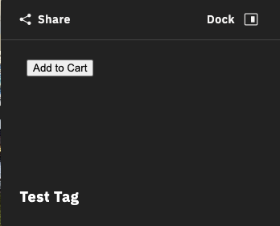
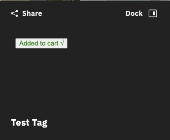
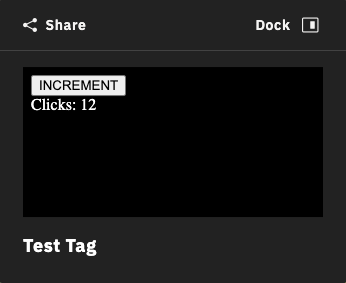

# Using Code Sandboxes

### What are Code Sandboxes

A code sandbox is a secure, isolated environment (i.e. iframe) that we provide to display custom HTML. The sandbox can also run Javascript with some exceptions.

The sandbox cannot access things in any other windows and only has the ‘allow-javascript’ flag and cannot submit forms, initiate downloads, etc ([see MDN’s sandbox restrictions](https://developer.mozilla.org/en-US/docs/Web/HTML/Element/iframe#attr-sandbox)).

To get around these restrictions, it is possible to send data into and out of the sandbox to your SDK application as long as they can be cloned using the [structured-clone algorithm](https://developer.mozilla.org/en-US/docs/Web/API/Web\_Workers\_API/Structured\_clone\_algorithm).

#### Terminology

* **SDK Application**: The application that embeds and interacts with Showcase through the SDK.
* **Sandbox**: The (iframe) environment that will run custom Javascript and display custom HTML.
* **Attachment**: Any type of media that can be attached to a tag, e.g. images, videos, code sandboxes.
* **Messenger**: The mechanism to get data into and out of a sandbox.

### Creating a Sandbox Attachment

Sandboxes are treated similar to any other attachment. They can be registered, attached, and detached at any time.

**Hello World Sandbox**

To start, we will create a simple “Hello World” sandbox to show a custom message, style it, and attach it to a Tag.

```typescript
// create a tag
const [tagId] = await mpSdk.Tag.add({
  label: 'Test Tag',
  anchorPosition: { x: 0, y: 0, z: 0 },
  stemVector: { x: 0, y: 0.3, z: 0 },
});

// register a static sandbox
const [sandboxId] = await mpSdk.Tag.registerSandbox(`
<style>
body {
  color: #fff;
  background-color: #000;
}
</style>
Hello, Sandbox!
`);

// associate (attach) the sandbox to the tag
mpSdk.Tag.attach(tagId, sandboxId);
```

Now, when the tag is opened, it should display a simple “Hello World” message in white text on a black background.

It is, of course, completely possible to set the background to have 0 opacity `rgba(0, 0, 0, 0)` or to `#222` to match the rest of the tag’s background color, but for the sake of these demos and showing the afforded region, it stands out with a completely opaque, black background.

**Adding Interactivity**

Sandbox attachments are much more capable than just displaying static HTML. It is also possible to execute scripts within the sandbox.

To implement a counter that increments as we click a button, we can add a script tag to our custom HTML that will get the elements and add calbacks or mutate them.

```typescript
// register an interactive sandbox
const [attachmentId] = await mpSdk.Tag.registerSandbox(`
<style>
body {
  color: #fff;
  background-color: rgba(0, 0, 0, 0);
}
</style>

<button id='inc'>INCREMENT</button>
<div id='output'>No clicks yet</div>

<script>
  const incrementor = document.getElementById('inc');
  const output = document.getElementById('output');
  let clicks = 0;
  incrementor.addEventListener('click', () => {
    ++clicks;
    output.innerHTML = \`Clicks: \${clicks}\`;
  });
</script>
`)

// using the `tagId` from the previous example
mpSdk.attach(tagId, attachmentId);
```

Opening the tag should display a button with a counter that increments as the button is clicked. **Note**: state is not persisted as the tag is closed, and subsequently the sandbox being torn down, and reopened, and the sandbox being re-instantiated. In this example, the counter will reset to 0 if the tag is closed.

<figure><figcaption></figcaption></figure>

**Communicating with the Sandbox**

Since sandbox environments are so heavily restricted, for security reasons, we return an [`IMessenger`](https://matterport.github.io/showcase-sdk/docs/reference/current/interfaces/tag.imessenger.html) object when registering a sandbox.

All sandboxes have a global `send`, `on`, and `off` function.\
The messenger object also has a `send`, `on`, and `off` function.\
These are the mechanism available to move data between an SDK application and a sandbox.

Up until now, we have only been using the `attachmentId` returned by `registerSandbox`. The second object returned is the messenger.

```typescript
// register the attachment and get a reference to its messenger
const [attachmentId, messenger] = await mpSdk.Tag.registerSandbox(`
<!-- don't forget styling -->
<button id='add'>Add to Cart</button>

<script>
const productId = 12345;
const quantity = 1;
const add = document.getElementById('add');
add.addEventListener('click', () => {
  // send an 'add.to.cart' message out to the SDK application with some data
  window.send('add.to.cart', productId, quantity);
});

// receive a 'product.added' message from the SDK application
window.on('product.added', () => {
  add.innerHTML = 'Added to cart √';
  add.style.color = 'green';
});
</script>
`);

// add a handler for the 'add.to.cart' message that will come from the sandbox
messenger.on('add.to.cart', (productId, quantity) => {
  // do some work
  console.log(`adding ${quantity}x of ${productId} to cart`);
  // send a 'product.added' message back to the sandbox
  messenger.send('product.added');
});

// finally, attach the sandbox to the tag using `tagId` from previous examples
mpSdk.attach(tagId, attachmentId);
```

Opening this tag will show a button that communicates to an SDK application that some quantity of a product should be added to a shopping cart when clicked. The SDK application then sends a message back confirming it has added the product which subsequently updates the button in the sandbox.

<figure><figcaption><p>Initial Sandbox State</p></figcaption></figure>

<figure><figcaption><p>After receiving the 'product.added' message from the SDK application</p></figcaption></figure>

The data sent between the SDK application and sandbox don’t need to be simple strings or numbers and can be any object or type that can be cloned via the [structured-clone algorithm](https://developer.mozilla.org/en-US/docs/Web/API/Web\_Workers\_API/Structured\_clone\_algorithm). It’s also possible to send any number of arguments as needed, not just 2 or 0 as in the example, that will act as arguments to the callbacks added with the `on` functions.

**Persisting or Setting Initial State**

As previously mentioned, state of the sandbox is not persisted as it is unmounted and remounted. We can mimic an “initialization” lifecycle using custom messages and listeners.

Upon mounting the sandbox, we will have it send an `'init'` message, have our app listen for it and send its own `'initial.state'` message which the sandbox will listen for. We also add `'current.state'` messages to save the current state of the sandbox in our app.

To demonstrate this, we will slightly modify our “counter” example and persist the number of clicks done.

```typescript
const [attachmentId, messenger] = mpSdk.Tag.registerSandbox(`
<button id='inc'>INCREMENT</button>
<div id='output'>No clicks yet</div>

<script>
  const incrementor = document.getElementById('inc');
  const output = document.getElementById('output');

  // the initial state of the sandbox
  let state = {
    clicks: 0,
  };

  // add a handler to increment the click state
  incrementor.addEventListener('click', () => {
    ++state.clicks;
    output.innerHTML = \`Clicks: \${state.clicks}\`;
    // tell our app that we have updated our state
    window.send('current.state', state);
  });

  // add a handler to receive the persisted state and update the sandbox's state
  window.on('initial.state', (initialState) => {
    state.clicks = initialState.clicks;
    output.innerHTML = \`Clicks: \${state.clicks}\`;
  });

  // finally, tell our app that we have mounted the sandbox
  window.send('init');
</script>
`);

// the initial representation of the state in the sandbox
let sandboxState = { clicks: 0 };
// add a handler for the sandbox's 'init' "lifecycle"
messenger.on('init', () => {
  // send the persisted state of the sandbox to set the state of the sandbox
  // unfortunately, when the sandbox is mounted it isn't immediately ready to receive messages so we need to timeout to delay the message just enough (this will likely change in future updates)
  setTimeout(() => messenger.send('initial.state', sandboxState));
});

// add a handler to update our representation of the sandbox's state
messenger.on('current.state', (currentState) => {
  sandboxState.clicks = currentState.clicks;
});

// finally, attach the sandbox to the tag, reusing the same `tagId` as before
mpSdk.Tag.attach(tagId, attachmentId)
```

The key here is to create serializable representations of the sandbox’s state both inside and outside of the sandbox, tell the SDK application that the state has changed, and feed that state back to the sandbox as it gets remounted. Unfortunately, at this time, a message sent too soon after the remount may not be received by the sandbox, so a slight delay is necessary. This will likely be resolved in a future update.

<figure><figcaption><p>The initial state of the sandbox should be set each time it mounts</p></figcaption></figure>

**Identifying the Sandbox**

Because each sandbox is treated just as an attachment, it can be attached to multiple tags at the same time.

```typescript
const [attachmentId, messenger] = mpSdk.Tag.registerSandbox(/* ... */);
mpSdk.Tag.attach(tagId0, attachmentId);
mpSdk.Tag.attach(tagId1, attachmentId);
```

One problem that might arise is that the `messenger` associated with the sandbox doesn’t know any other context of the sandbox, like which tag it is currently mounted in.

We can modify the [previous shopping cart example](https://matterport.github.io/showcase-sdk/htmlsandbox.html#communicating-with-the-sandbox) so that we can reuse the same sandbox for every product if we associate each tag with a product instead of creating a separate sandbox for each tag/product pair. For this purpose, we provide a global `tag` id to the sandbox.

```typescript
const [attachmentId, messenger] = mpSdk.Tag.registerSandbox(`
<button id='add'>Add to Cart</button>

<script>
const add = document.getElementById('add');

add.addEventListener('click', () => {
  // send an 'add.to.cart' message with the current tag's id
  window.send('add.to.cart', window.tag);
});
</script>
`);

const [tagId0, tagId1] = // populated by using `mpSdk.Tag.data`
// an association between tags and product ids
const tagProductMap = {
  [tagId0]: 'p12345',
  [tagId1]: 'p54321',
};

// attach the same sandbox to multiple tags
mpSdk.Tag.attach(tagId0, attachment);
mpSdk.Tag.attach(tagId1, attachment);

// add a 'add.to.cart' handler that will look up the product via the tag's id
messenger.on('add.to.cart', (tagId) => {
  console.log('added product: ', tagProductMap[tagId]);
});
```
