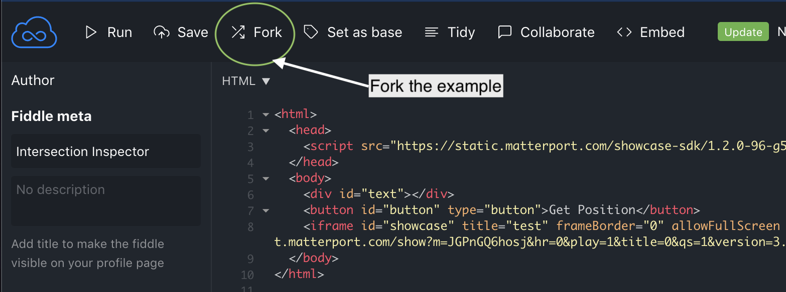
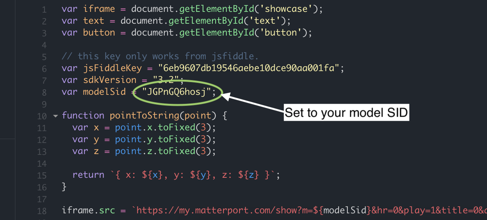
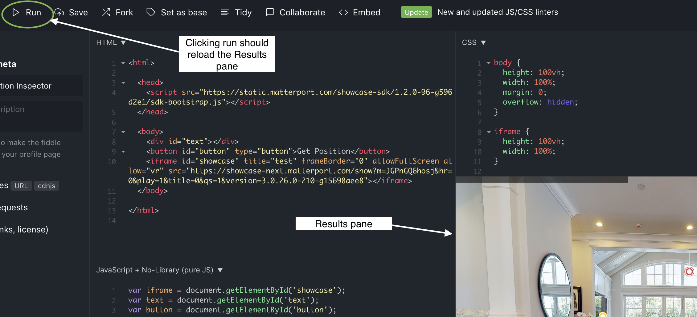
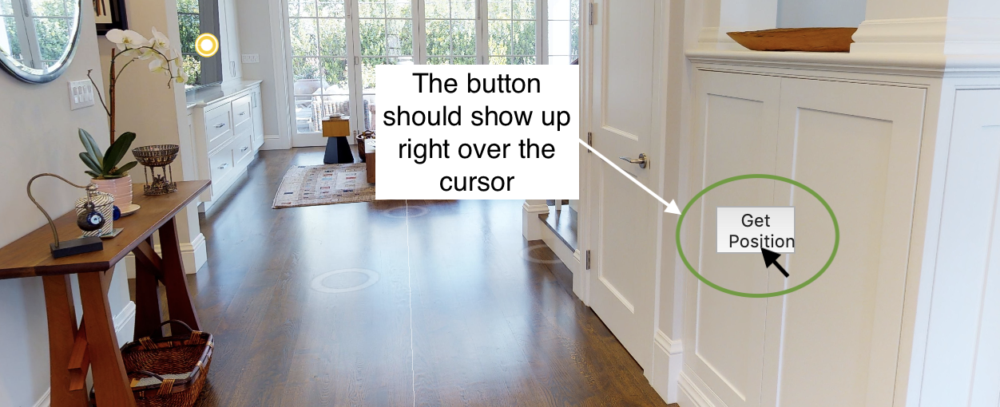
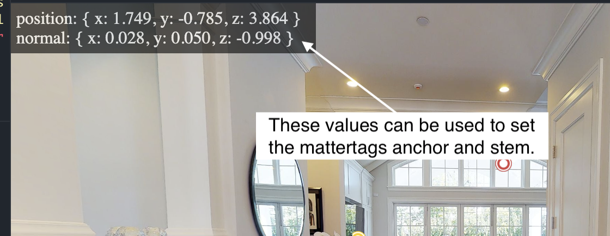

# Intersection Inspector

You can use this tool to inspect the surfaces of a model. It is a jsfiddle application located here, [http://jsfiddle.net/guillermo\_matterport/pftnhkuc](http://jsfiddle.net/guillermo\_matterport/pftnhkuc)

### Setting up a model in the intersection inspector

* Go to this jsfiddle editor link [Editor](http://jsfiddle.net/guillermo\_matterport/pftnhkuc/?utm\_source=website\&utm\_medium=embed\&utm\_campaign=pftnhkuc) You can also select `Edit in JSFiddle` at the bottom of this page.
* Select `Fork` to create your own copy of the application.\

<figure><figcaption></figcaption></figure>

* Set your model sid. Look for the modelSid variable.

<figure><figcaption></figcaption></figure>

* Run your updated application. You should see your model loaded in the Results pane.\

<figure><figcaption></figcaption></figure>

### Using the intersection inspector

* Load the application after you have setup your model.
* Navigate to the location on the model that you would like to inspect.
* Place the mouse over the area of interest and stop moving it. You should see a button pop up right over the mouse. If you move the mouse outside the area of the button, it will disappear.\

<figure><figcaption></figcaption></figure>

* Click the button and look at the upper left of the showcase window. You will see the 3D position and normal for the point you clicked.\

<figure><figcaption></figcaption></figure>

* Copy the position and normal text. You can use the position value to set the mattertag anchor position and normal value to set the stem.


