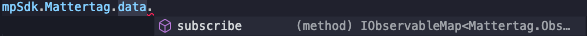
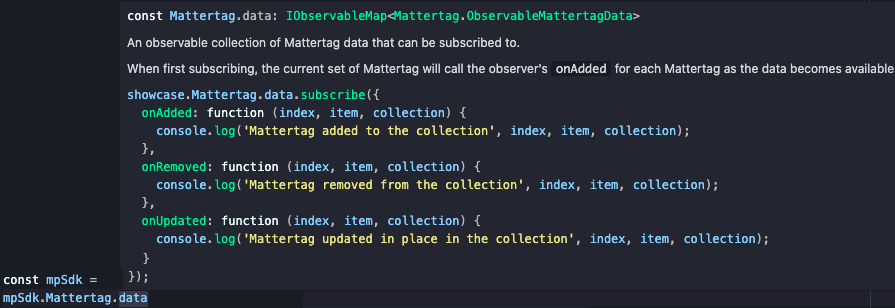

# Typescript Definitions

### Acquiring the Type Declarations

Our current types are located [here](https://static.matterport.com/showcase-sdk/types/3.1.75.3-0-gba9de22f6d/sdk.d.ts)

### Why Use Types?

#### Code completion or Intellisense

Make fewer mistakes by using your IDE to suggest the available properties on the sdk.

<figure><figcaption></figcaption></figure>

#### Code comments and reference documentation in your IDE

Hover over any property of our sdk (namespace, function, observable, etc) to get access to the same documentation that is available here.\
\
(Hovering `mpSdk.Mattertag.data`)

<figure><figcaption></figcaption></figure>

### Getting Started with Type Declarations

To get started, cast your window to the `ShowcaseEmbedWindow` and start using the MP\_SDK object on it.

```typescript
import { ShowcaseEmbedWindow } from './mp/sdk';

const showcaseIframe = document.getElementById('showcase-iframe') as HTMLIFrameElement;
const embeddingWindow = window as ShowcaseEmbedWindow;
const mpSdk = await embeddingWindow.MP_SDK.connect(showcaseIframe, '{YOUR SDK KEY}');

// start using mpSdk
mpSdk.Sweep.moveTo('sweep1234', { transition: mpSdk.Sweep.TransitionType.FADEOUT });
```

### Using Individual Namespaces

Once you have your `mpSdk` object, you’ll likely want to pass it around and/or use other types provided by the sdk.\
All namespaces and their types are also available through the root `MpSdk` type.

```typescript
// tourControls.ts
import { Tour } from './mp/sdk'

export function startTour(tour: Tour) {
  tour.start();
}

// use the Snapshot type through the Tour type
export function getTourSnapshots(tour: Tour): Promise<Tour.Snapshot[]> {
  return tour.getData();
}

// index.ts
import { MpSdk } from './mp/sdk';
import { startTour } from './tourControls.ts'

async function useTourControls(mpSdk: MpSdk) {
  startTour(mpSdk.Tour);
  // use the Snapshot type through the MpSdk type
  const tourSnapshots: MpSdk.Tour.Snapshot[] = await getTourSnapshots(mpSdk.Tour);
}
```
