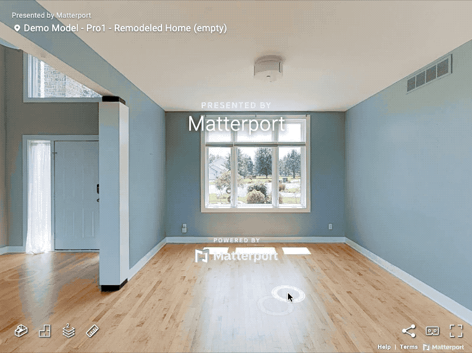

# Controlling the Pointer Reticle

### Visibility Control

You can control the visibility of the pointer reticle. See [Pointer.setVisible](https://matterport.github.io/showcase-sdk/docs/reference/current/modules/pointer.html#setvisible)


**Note:** The user can continue to interact with the space while the cursor is not visible.


<figure><figcaption></figcaption></figure>

### Custom Texture

You can set the pointer reticle texture. See [Pointer.registerTexture](https://matterport.github.io/showcase-sdk/docs/reference/current/modules/pointer.html#registertexture), [Pointer.editTexture](https://matterport.github.io/showcase-sdk/docs/reference/current/modules/pointer.html#edittexture), and [Pointer.resetTexture](https://matterport.github.io/showcase-sdk/docs/reference/current/modules/pointer.html#resettexture). You will need to register your textures prior to calling `Pointer.editTexture`.

<figure><figcaption></figcaption></figure>
