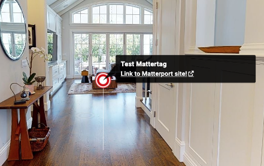
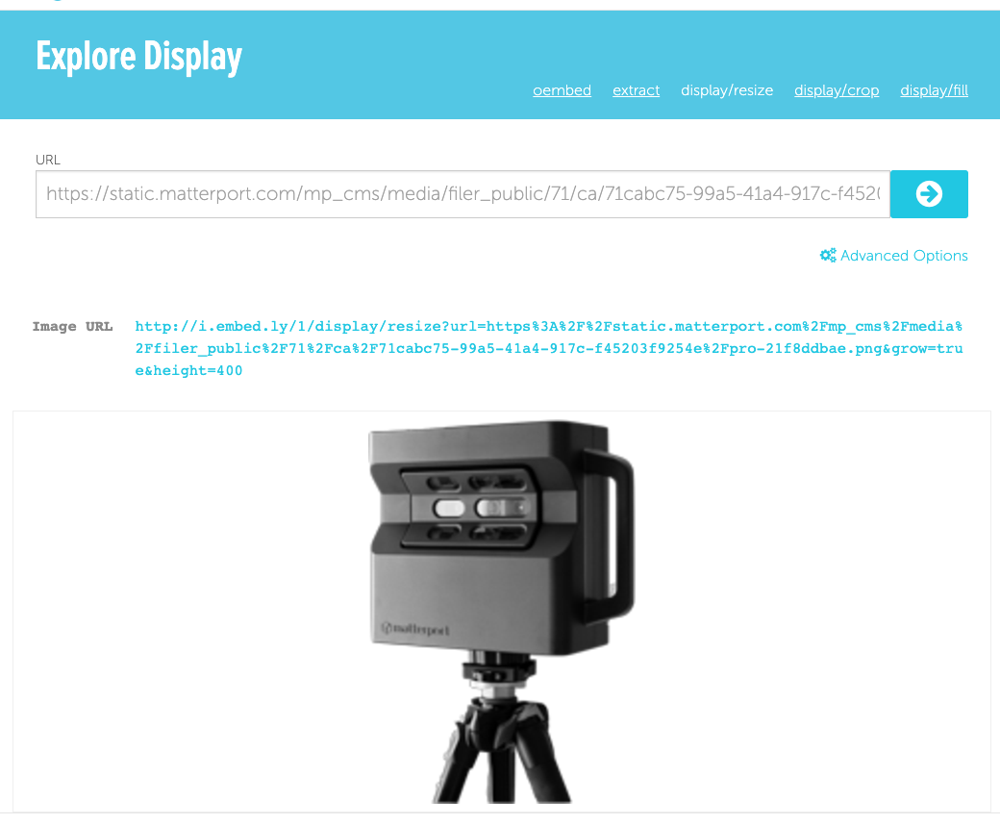
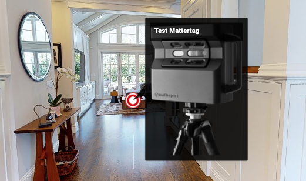
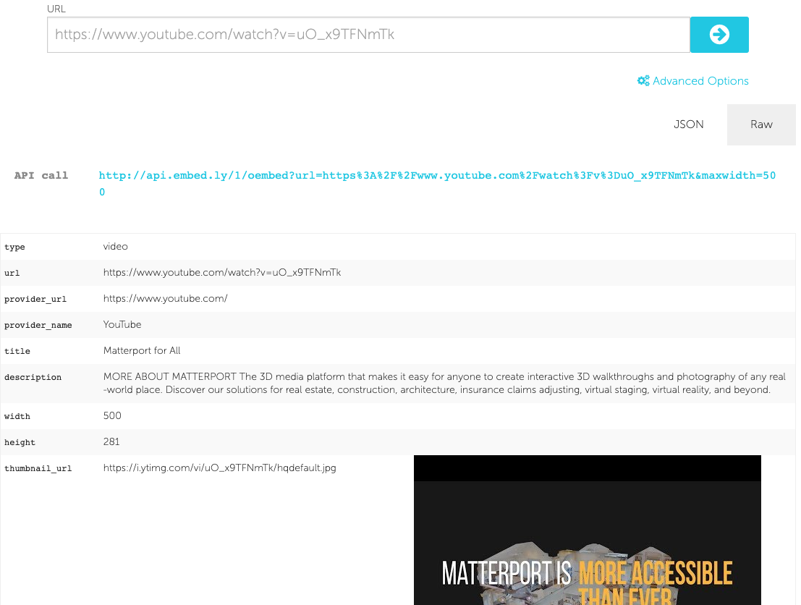
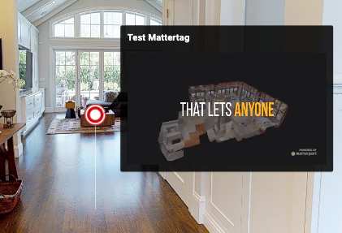

# Editing Mattertags

### Adding a link to the description

The description supports the following markdown link format:

`[link text](link url)`

The following code snippets produces the image below it.

```typescript
sdk.Mattertag.editBillboard(mattertagSid, {
  description:"[Link to Matterport site!](https://www.matterport.com)",
});
```

<figure><figcaption></figcaption></figure>

### Setting an image media source

We use embedly to present image media. We recommend that you verify your image url with the embedly explore display tool before setting it as a media source.

* Select your image url. For example we will use,

url: `https://static.matterport.com/mp_cms/media/filer_public/71/ca/71cabc75-99a5-41a4-917c-f45203f9254e/pro-21f8ddbae.png`

<figure><figcaption></figcaption></figure>

*   Verify your image is displayed correctly on the embedly explore display tool

    <figure><figcaption></figcaption></figure>
* Call [Mattertag.editBillboard](https://matterport.github.io/showcase-sdk/docs/reference/current/modules/mattertag#editbillboard) with the media source to update the billboard

```typescript
sdk.Mattertag.editBillboard(mattertagSid, {
  media: {
  type: sdk.Mattertag.MediaType.PHOTO,
  src: 'https://static.matterport.com/mp_cms/media/filer_public/71/ca/71cabc75-99a5-41a4-917c-f45203f9254e/pro-21f8ddbae.png',
});

```

<figure><figcaption></figcaption></figure>

### Setting a video media source

We use embedly to present video media. We recommend that you verify your video url with the embedly explore embed tool before setting it as a media source.

* Select your video url. For example we will use,

url: `https://www.youtube.com/watch?v=uO_x9TFNmTk`

<figure><figcaption></figcaption></figure>

*   Verify your video is displayed correctly on the embedly explore embed tool

    <figure><figcaption></figcaption></figure>
* Call [Mattertag.editBillboard](https://matterport.github.io/showcase-sdk/docs/reference/current/modules/mattertag#editbillboard) with the media source to update the billboard

```typescript
sdk.Mattertag.editBillboard(mattertagSid, {
  media: {
  type: sdk.Mattertag.MediaType.VIDEO,
  src: 'https://www.youtube.com/watch?v=uO_x9TFNmTk',
});
```

<figure><figcaption></figcaption></figure>
