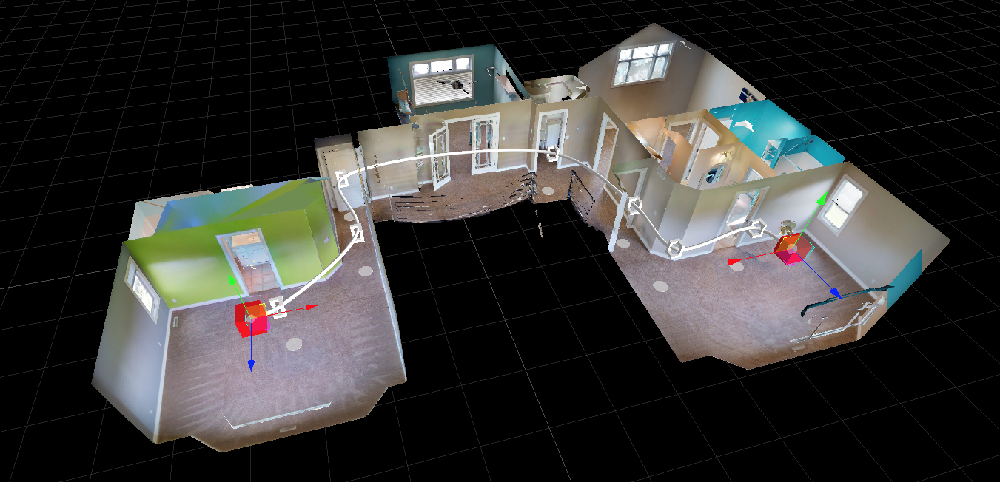

# Pathfinding

<figure><figcaption></figcaption></figure>

### What is Pathfinding

Pathfinding is the process of finding a route between two points. A specific example and use case would be something like: find the set of sweeps that join two areas of a building, like a path from your desk in the office to the office’s exit, or from the desk to the emergency exit, or the desk to the cafeteria, etc.

#### Terminology

For Matterport’s implementation, we have opted to use (and expose via our SDK) graphs and the A\* algorithm.

**Graph**: The connectivity chart between points.\
**Vertex**: A point in the graph.\
**Edge**: A connection between two vertices in the graph.\
**Weight**: A value associated with an edge that determines its “difficulty” to traverse. A lower value or easier path to traverse will be chosen first when finding a path.\
**A\***: The search algorithm used to find a path in a graph. A\* uses a heuristic, or rough estimation to make a more educated guess about the path to traverse.\


### General Graph Usage

(For a specific Sweep example, continue to the following section) For this generic example, we will be creating a small graph and traverse it. It will look like this.

13562ABCD

We will then use A\* to generate a path from `'A'` to `'D'`. The resulting path should be `[A, B, C, D]` despite there being paths with fewer steps. The determining factor for the path is the overall weight. For example:

* The sub-path `[A, B, C]` is chosen over `[A, C]` because the total weight is 4 and 5 respectively.
* The sub-path `[B, C, D]` is chosen over `[B, D]` because the total weight is 5 and 6 respectively.

**Creating the Graph**

To get started, we create an empty graph using the [`Graph.createDirectedGraph()`](https://matterport.github.io/showcase-sdk/docs/reference/current/modules/graph.html#createdirectedgraph) function.

```typescript
const graph = mpSdk.Graph.createDirectedGraph();
```

With an empty graph, we can start adding the vertices.

**Adding the Vertices**

Adding a vertex or set of vertices can be done using [`IDirectedGraph.addVertex`](https://matterport.github.io/showcase-sdk/docs/reference/current/interfaces/graph.idirectedgraph.html#addvertex). An id MUST be provided for each vertex; each vertex can also contain arbitrary user data. For our example, we’ll just add some arbitrary “indices” to each vertex.

Let’s add vertices `'A' - 'D'`

```typescript
// add a single vertex
graph.addVertex({ id: 'A', data: 0 });

// add multiple vertices
graph.addVertex(
  { id: 'B', data: 1 },
  { id: 'C', data: 2 },
  { id: 'D', data: 3 },
);
```

Now that we have vertices, we can connect vertices with edges.

**Adding Edges**

Adding an edge or set of edges is done using [`IDirectedGraph.setEdge`](https://matterport.github.io/showcase-sdk/docs/reference/current/interfaces/graph.idirectedgraph.html#setedge). Since edges are a relationship between vertices, creating an edge requires references to the vertices. Vertices can be queried using [`IDirectedGraph.vertex`](https://matterport.github.io/showcase-sdk/docs/reference/current/interfaces/graph.idirectedgraph.html#vertex).

Note: edges have directionality so an edge from vertex ‘A’ to vertex ‘B’ is a distinct edge from an edge from vertex ‘B’ to vertex ‘A’.

Let’s add edges as described in the diagram.

```typescript
// first get references to the vertices
const a = graph.vertex('A');
const b = graph.vertex('B');
const c = graph.vertex('C');
const d = graph.vertex('D');

// check that the vertices were found
if (!a || !b || !c || !d) throw Error(`one of vertices 'A', 'B', 'C', or 'D' was not in the graph`);

// setting a single edge
graph.setEdge({ src: a, dst: b, weight: 1 });

// setting multiple edges
graph.setEdge(
  { src: a, dst: b, weight: 5 },
  { src: b, dst: c, weight: 3 },
  { src: b, dst: d, weight: 6 },
  { src: c, dst: d, weight: 2 },
);
```

We should now have a graph that looks like the one in the diagram. We can start trying to find paths between vertices.

**Finding a Path**

Finding a path in a graph is done using an “A\* Runner”, created by [`Graph.createAStarRunner`](https://matterport.github.io/showcase-sdk/docs/reference/current/modules/graph.html#createastarrunner) and calling its [`IAStarRunner.exec`](https://matterport.github.io/showcase-sdk/docs/reference/current/interfaces/graph.iastarrunner.html#exec). The result of `exec` is cached so multiple calls will not recompute the path and will return the same object (until there are changes to the graph – see [Observing Changes](https://matterport.github.io/showcase-sdk/sdkbundle\_pathfinding.html#observing-changes)).

Let’s compute a path from `'A'` to `'D'`.

```typescript
const aStarRunner = mpSdk.Graph.createAStarRunner(graph, a, d);
const result = aStarRunner.exec();
```

`result` should now have a `.status` of `mpSdk.Graph.AStarStatus.SUCCESS` and a `.path` of `[a, b, c, d]` like we predicted in our diagram.

If we later decide to add new vertices and/or update edges, our shortest path may have changed. Observability can give us a hint about those changes.

**Observing Changes**

Both Graphs and the A\* Runners are observable meaning they can let us know when they have undergone changes. Changes to vertices and the edges of a graph and the path of an A\* Runner can all be subscribed to.

Observability is provided by [`IDirectedGraph.onVerticesChanged`](https://matterport.github.io/showcase-sdk/docs/reference/current/interfaces/graph.idirectedgraph.html#onverticeschanged) and [`IDirectedGraph.onEdgesChanged`](https://matterport.github.io/showcase-sdk/docs/reference/current/interfaces/graph.idirectedgraph.html#onedgeschanged) for graphs.

> **Important**: After making changes to a graph, it is necessary to call [`IDirectedGraph.commit`](https://matterport.github.io/showcase-sdk/docs/reference/current/interfaces/graph.idirectedgraph.html#commit) to signal that any modification is now finished. `commit` will have no effect and no observers notified, if there have been no changes to the graph.

Let’s subscribe to a graph and make some changes to it.

```typescript
// subscribe to vertex changes
graph.onVerticesChanged({
  onChanged() {
    console.log('vertices in the graph have changed');
  }
});
// subscribe to edge changes
graph.onEdgesChanged({
  onChanged() {
    console.log('edges in the graph have changed');
  }
});

graph.addVertex({ id: 'E', data: 4 });
// we can call `graph.commit()` here to trigger the `onVerticesChanged` observer, but ...
// ... if we know we'll be making more changes, we should hold off on calling `commit` until then

const e = graph.vertex('E');
graph.setEdge({ src: a, dst: e, weight: 10 });
graph.commit(); // <-- will trigger the attached observer in `onVerticesChanged` and `onEdgesChanged`
graph.commit(); // <-- will no-op since the graph has not changed since the last `commit`
```

A\* Runners are observable through [`IAStarRunner.subscribe`](https://matterport.github.io/showcase-sdk/docs/reference/current/interfaces/graph.iastarrunner.html#subscribe). The instance of the runner is provided in the callback.

Let’s subscribe to an A\* Runner.

```typescript
let result = aStarRunner.exec();
// we can subscribe with an object ...
aStarRunner.subscribe({
  onChanged(runner) {
    result = runner.exec()
  }
});
// or a function
aStarRunner.subscribe((runner) => {
  result = runner.exec();
});

// reduce the weight of edge AC to make it a more viable option
graph.setEdge({ src: a, dst: c, weight: 2 });
graph.commit(); // <-- will trigger the A* Runner's observers which will recompute the path.
```

`result` should have a new `.path` of `[a, c, d]` since we made the sub-path `[a, c]` a better (lighter) option than the previous `[a, b, c]`.

### Finding a Path Using Sweep.createGraph

For a more concrete example of pahtfinding, we also expose a way to create a graph from the Sweeps within a Matterport Digital Twin.

We provide a way to automatically create a graph derived from our `Sweep.data` using [Sweep.createGraph](https://matterport.github.io/showcase-sdk/docs/reference/current/modules/sweep.html#creategraph). When done with the graph, its [`dispose`](https://matterport.github.io/showcase-sdk/docs/reference/current/interfaces/graph.idirectedgraph.html#dispose) should be called to cleanup its resources. Some features of this sweep graph:

* The graph returned will only contain `enabled` sweeps
* The graph is automatically updated as sweep data is changed
  * enabling sweeps will automatically be added to the graph
  * disabling sweeps will automatically removed them from the graph
* Each vertex’s `id` is the id of the associated sweep
* Each vertex’s `data` is the same as each item in the sweep collection from `Sweep.data`
* Each edge’s `weight` is the Euclidean distance between neighboring sweeps

```typescript
const sweepGraph = await mpSdk.Sweep.createGraph();
const startSweep = sweepGraph.vertex('[start sweep id]');
const endSweep = sweepGraph.vertex('[end sweep id]');

// do standard path finding
const aStarRunner = mpSdk.Graph.createAStarRunner(sweepGraph, startSweep, endSweep);
const path = aStarRunner.exec().path;

// the runner will be subscribed to the graph, which is subscribed to sweep data
aStarRunner.subscribe({
  onChanged(runner) {
    console.log('sweep graph has changed');
  }
});

mpSdk.Sweep.disable('[intermediate sweep]'); // <-- will trigger the above `onChanged` if the sweep was previously enabled

// finally, clean up the graph when no longer needed
sweepGraph.dispose();
```

**Modifying the Sweep Graph**

Since the sweep graph only uses the Euclidean distance between sweeps, it generally prioritizes long distance “transitions” between sweeps. In order to incentivize taking shorter, but potentially more, “transitions” between sweeps, we can scale the weight of each edge so that they no longer have a linear relationship.

We can iterate all of the edges of the graph using [`IDirectedGraph.edges`](https://matterport.github.io/showcase-sdk/docs/reference/current/interfaces/graph.idirectedgraph.html#edges) and then set each edge’s weight to the square of its current weight.

```typescript
for (const { src, dst, weight } of sweepGraph.edges) {
  sweepGraph.setEdge({ src, dst, weight: weight ** 2 });
}
```

Now that we’ve changed the edges’ weights in our graph, we’ve turned a graph like this …

1357ABCD

… into this.

192549ABCD

Traversing either graph from `'A'` to `'D'` will produce the paths `[A, D]` and `[A, B, C, D]` respectively.
